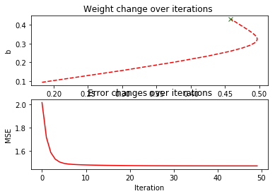
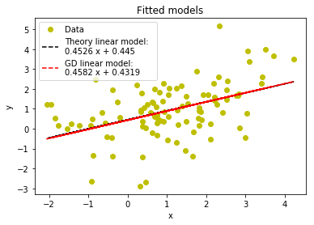

# Gradient-descent-from-scratch with Python
# Step
1) Generate data by multivariate guassian X and Y with mean (1,1) and covariance (2,1);(1,2)
2) Define cost function
Yhat = mx + b
Cost function = MSE = 1/N * (Y-Yhat)^2
3) define gradient equation
gradient m = partial delivative over m = sum (-2/N) * x *(y - (mx + b)))
gradient b = partial delivative over b = sum (-2/N) * (y - (mx + b)))

4) update weights (m and b) over iterations with defined learning rate
5) plot evolution of weights changes and reductionn of error over iterations



